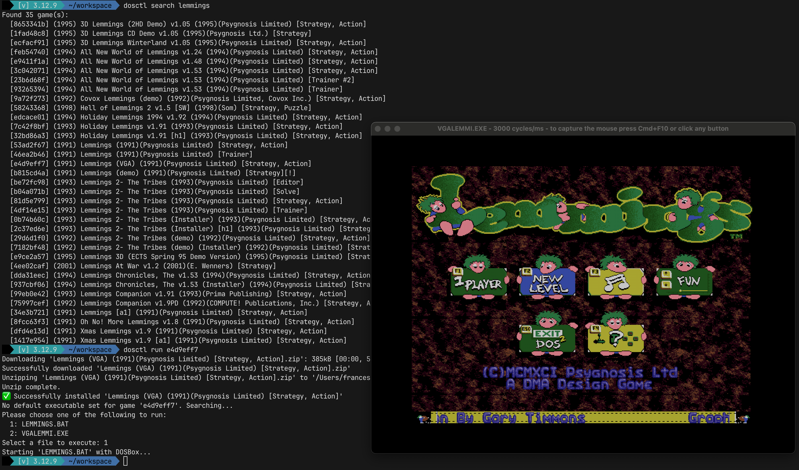

# DOSCtl

A command-line tool to manage and play DOS games via DOSBox.



## Installation

**Requirements:** Python 3.8+, [DOSBox](https://www.dosbox.com/)

```bash
# Install DOSBox
brew install dosbox          # macOS
sudo apt install dosbox      # Ubuntu/Debian

# Install DOSCtl
pip install dosctl
```

<details>
<summary>Other install methods</summary>

```bash
# From GitHub
pip install git+https://github.com/xesco/dosctl.git

# Development (editable)
git clone https://github.com/xesco/dosctl.git
cd dosctl
pip install -e ".[dev]"
```
</details>

## Getting Started

1. **List games** — the game catalog downloads automatically on first run:
    ```bash
    dosctl list
    ```
2. **Search** for a game:
    ```bash
    dosctl search "Dune" --sort-by year
    ```
3. **Run** a game by its ID. On first run, `dosctl` downloads, installs, and asks you to pick the executable:
    ```bash
    dosctl run <game-id>
    ```

## Commands

Every game has a unique 8-character ID (shown in `list`/`search` output). Use it for all operations.

### `dosctl list`

Lists all available games.

| Flag | Description |
|------|-------------|
| `-s, --sort-by [name\|year]` | Sort by name or year |
| `-i, --installed` | Only show installed games |

### `dosctl search <query>`

Searches for games. Query is optional if `--year` is used.

| Flag | Description |
|------|-------------|
| `-y, --year <year>` | Filter by year |
| `-c, --case-sensitive` | Case-sensitive search |
| `-s, --sort-by [name\|year]` | Sort by name or year |

### `dosctl run <game-id> [command-parts...]`

Runs a game. Downloads and installs it if needed. On first run, prompts for the main executable; the choice is saved for future runs.

You can override the saved executable by passing command parts directly, or use `--configure` to re-pick interactively:

```bash
dosctl run 62ef2769                    # Use saved default
dosctl run 62ef2769 --configure        # Re-pick executable interactively
dosctl run 62ef2769 setup.exe          # Run a specific executable
dosctl run 62ef2769 game.exe -level 5  # Pass arguments to the executable
```

### `dosctl inspect <game-id>`

Shows installed files for a game. Use `-e, --executables` to show only `.exe`/`.com`/`.bat` files.

### `dosctl delete <game-id>`

Deletes an installed game and its downloaded archive.

### `dosctl refresh --force`

Re-downloads the master game list from the Internet Archive.

## Configuration

Data is stored in platform-appropriate directories:

| Platform | Base directory |
|----------|---------------|
| Linux/macOS | `~/.local/share/dosctl/` |
| Windows | `%USERPROFILE%\AppData\Local\dosctl\` |

```
<base-dir>/
  downloads/       # Downloaded .zip archives
  installed/       # Extracted games
  collections/     # Game list cache
```

## Collection Backend

Games are sourced from the [Total DOS Collection Release 14](https://archive.org/details/Total_DOS_Collection_Release_14) on the Internet Archive. The catalog is downloaded on first use; individual games are downloaded on demand when you run them.

## Disclaimer

This tool does not host or distribute any games — it manages content from external sources. You are responsible for ensuring you have legal rights to any content you use. Windows support is experimental; Linux and macOS are the primary platforms.

See [LICENSE](LICENSE) for the full MIT license.
