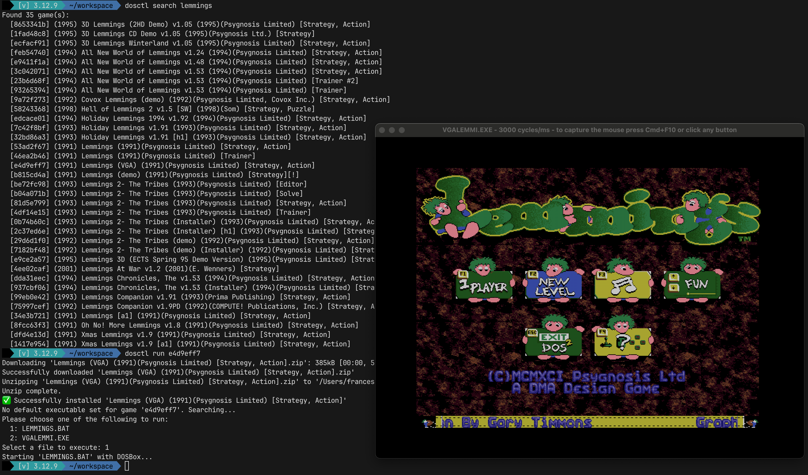

# DOSCtl

A command-line tool to manage and play DOS games via DOSBox.



## Installation

**Requirements:** Python 3.8+, [DOSBox](https://www.dosbox.com/)

```bash
# Install DOSBox
brew install dosbox          # macOS
sudo apt install dosbox      # Ubuntu/Debian

# Install DOSCtl
pip install dosctl
```

<details>
<summary>Other install methods</summary>

```bash
# From GitHub
pip install git+ssh://git@github.com/xesco/dosctl.git

# Development (editable)
git clone git@github.com:xesco/dosctl.git
cd dosctl
pip install -e ".[dev]"
```
</details>

## Getting Started

1. **List games** — the game catalog downloads automatically on first run:
    ```bash
    dosctl list
    ```
2. **Search** for a game:
    ```bash
    dosctl search "Dune" --sort-by year
    ```
3. **Play** a game by its ID. On first run, `dosctl` downloads, installs, and asks you to pick the executable:
    ```bash
    dosctl play <game-id>
    ```

## Commands

Every game has a unique 8-character ID (shown in `list`/`search` output). Use it for all operations.

### `dosctl list`

Lists all available games.

| Flag | Description |
|------|-------------|
| `-s, --sort-by [name\|year]` | Sort by name or year |
| `-i, --installed` | Only show installed games |

### `dosctl search <query>`

Searches for games. Query is optional if `--year` is used.

| Flag | Description |
|------|-------------|
| `-y, --year <year>` | Filter by year |
| `-c, --case-sensitive` | Case-sensitive search |
| `-s, --sort-by [name\|year]` | Sort by name or year |

### `dosctl play <game-id> [command-parts...]`

Runs a game. Downloads and installs it if needed. On first run, prompts for the main executable; the choice is saved for future runs.

| Flag | Description |
|------|-------------|
| `-c, --configure` | Force re-selection of the default executable |
| `-a, --floppy` | Also mount game directory as A: drive (for floppy-based installers) |
| `-n, --no-exec` | Open DOSBox with the game directory mounted but don't run anything (for debugging) |

You can override the saved executable by passing command parts directly, or use `--configure` to re-pick interactively:

```bash
dosctl play 62ef2769                    # Use saved default
dosctl play 62ef2769 --configure        # Re-pick executable interactively
dosctl play 62ef2769 setup.exe          # Run a specific executable
dosctl play 62ef2769 game.exe -level 5  # Pass arguments to the executable
```

Some games include floppy-based installers that expect source files on A: and install to C:. Use `-a` to mount the game directory as both drives:

```bash
dosctl play 62ef2769 install.bat C: -a  # Run installer with floppy mode
dosctl play 62ef2769 STARCON2/GAME.EXE  # Then run the installed game normally
```

To troubleshoot a game, open DOSBox at the game directory without running anything:

```bash
dosctl play 62ef2769 --no-exec          # Drop to C:\> prompt
dosctl play 62ef2769 --no-exec -a       # Drop to A:\> prompt (floppy mode)
```

**Per-game DOSBox config:** if a `dosbox.conf` file exists in the game's install directory, it is automatically loaded by DOSBox (via `-conf`). Use it to override cycles, memory, sound settings, or any other DOSBox option for that specific game. The `net host` and `net join` commands honour the same file.

### `dosctl inspect <game-id|alias>`

Shows installed files for a game. Use `-e, --executables` to show only `.exe`/`.com`/`.bat` files.

### `dosctl info <game-id|alias>`

Shows catalog metadata and local status for a game: name, ID, release year, alias (if set), download/install status, install path, and the saved default executable.

### `dosctl delete <game-id|alias>`

Deletes an installed game and its downloaded archive.

### `dosctl refresh --force`

Re-downloads the master game list from the Internet Archive.

### `dosctl alias`

Manage short, memorable names (aliases) for game IDs. Aliases can be used in place of the 8-character ID in any command that accepts one (`play`, `inspect`, `info`, `delete`, `net host`, `net join`).

Alias names must start with a letter or digit and contain only lowercase letters, digits, and hyphens.

#### `dosctl alias set <alias> <game-id>`

Create or update an alias:

```bash
dosctl alias set doom 62ef2769
dosctl play doom        # same as: dosctl play 62ef2769
```

#### `dosctl alias remove <alias>`

Remove an alias.

#### `dosctl alias list`

List all defined aliases.

### `dosctl net host <game-id|alias>`

Hosts a multiplayer game using DOSBox IPX networking. By default, hosts on your local network. Use `--internet` to enable internet play with automatic UPnP port mapping and a discovery code.

| Flag | Description |
|------|-------------|
| `-p, --port <port>` | UDP port for the IPX server (default: 19900) |
| `-c, --configure` | Force re-selection of the default executable |
| `-i, --internet` | Enable internet play (UPnP port mapping + discovery code) |
| `-I, --public-ip <ip>` | Specify your public IP (skips automatic detection; requires `--internet`) |
| `-U, --no-upnp` | Skip UPnP port mapping (requires `--internet`) |
| `-n, --no-exec` | Open DOSBox with IPX server running but don't run anything (for debugging) |

### `dosctl net join <game-id|alias> <host>`

Joins a multiplayer game hosted by another player. The host argument can be a raw IP address (for LAN) or a discovery code (for internet play).

| Flag | Description |
|------|-------------|
| `-p, --port <port>` | UDP port of the IPX server (default: 19900) |
| `-c, --configure` | Force re-selection of the default executable |

**Example — LAN play:**

```bash
# Player 1 (host):
dosctl net host 62ef2769
# Output: "Your local IP appears to be: 192.168.1.42"

# Player 2 (join with IP):
dosctl net join 62ef2769 192.168.1.42
```

**Example — internet play:**

```bash
# Player 1 (host with internet mode):
dosctl net host 62ef2769 --internet
# Output: "Your discovery code: DOOM-3KF8A"

# Player 2 (join with discovery code):
dosctl net join 62ef2769 DOOM-3KF8A
```

If UPnP fails or you've already forwarded the port manually:

```bash
dosctl net host 62ef2769 --internet --no-upnp --public-ip 203.0.113.5
```

Both DOSBox instances start with IPX networking enabled. Configure multiplayer in the game's own network/modem menu (select IPX). DOSBox stays open after the game exits so you can play again without reconnecting.

## Configuration

Data is stored in platform-appropriate directories:

| Platform | Config directory | Data directory |
|----------|-----------------|----------------|
| Linux | `~/.config/dosctl/` | `~/.local/share/dosctl/` |
| macOS | `~/.local/share/dosctl/` | `~/.local/share/dosctl/` |
| Windows | `%USERPROFILE%\AppData\Local\dosctl\` | `%USERPROFILE%\AppData\Local\dosctl\` |

**Config directory** (settings and aliases):
```
<config-dir>/
  aliases.json     # Saved game aliases
  ipx.conf         # DOSBox IPX networking config (auto-generated)
```

**Data directory** (game files):
```
<data-dir>/
  downloads/       # Downloaded .zip archives
  installed/       # Extracted games
    <game-id>/     # Game install directory
      dosbox.conf  # Optional per-game DOSBox config
  collections/     # Game list cache
```

## Collection Backend

Games are sourced from the [Total DOS Collection Release 14](https://archive.org/details/Total_DOS_Collection_Release_14) on the Internet Archive. The catalog is downloaded on first use; individual games are downloaded on demand when you run them.

## Disclaimer

This tool does not host or distribute any games — it manages content from external sources. You are responsible for ensuring you have legal rights to any content you use. Windows support is experimental; Linux and macOS are the primary platforms.

See [LICENSE](LICENSE) for the full MIT license.
