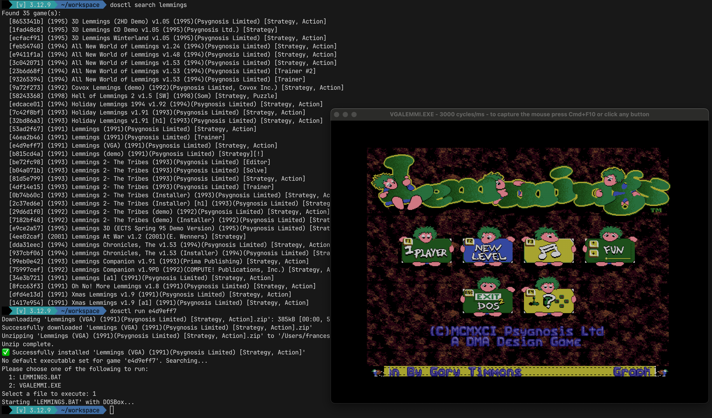

# dosctl

dosctl is a command-line tool that plays DOS games in DOSBox: type an ID or an alias, and the game runs — no archive hunting, no manual unzip, no DOSBox setup. Its catalog (the list of games it can play) comes either from the [Total DOS Collection Release 14](https://archive.org/details/Total_DOS_Collection_Release_14) on the Internet Archive, which holds over 20,000 entries, or from your own sources: a directory of zip archives, or an S3-compatible bucket (see [Where the games come from](#where-the-games-come-from)). When you play a game for the first time, dosctl unpacks it, downloading it first when it comes from the Internet Archive or a bucket, and starts it in DOSBox with the game's directory as drive C:. This page is for a person who wants to play those games from a terminal on Linux, macOS or Windows. It shows how to install dosctl and play your first game, then describes every command with its flags and output and every file dosctl writes.



## Installation

dosctl needs Python 3.8 or newer and DOSBox. dosctl runs the first DOSBox program it finds in the order of the table below. Linux and macOS are the primary platforms, and Windows support is experimental. Some archives from the early 1990s use a compression method (PKZIP Implode) that Python cannot read; dosctl unpacks those with the `unzip` command, which macOS includes and Linux package managers provide.

| Platform | DOSBox programs dosctl looks for, in order |
|----------|-------------------------------------------|
| Linux, macOS | `dosbox-staging` on your PATH, then `dosbox` on your PATH |
| Windows | `dosbox.exe` or `dosbox` on your PATH, then `C:\Program Files\DOSBox\dosbox.exe`, then `C:\Program Files (x86)\DOSBox\dosbox.exe` |

Install DOSBox with your package manager, then install dosctl with pip:

```bash
brew install dosbox          # macOS
sudo apt install dosbox      # Ubuntu/Debian
pip install dosctl
```

uv or pipx installs dosctl in an environment of its own. pip can also install dosctl directly from the GitHub repository instead of the released package:

```bash
uv tool install dosctl       # or: pipx install dosctl
pip install git+ssh://git@github.com/xesco/dosctl.git
```

## Getting started

Every game in the catalog has an ID of 8 characters. `list` and `search` print the ID in square brackets before the year and the name, and the other commands take the ID as their first argument.

1. List the games. The first command that needs the catalog downloads it and saves it in a local file, so later commands read the file:

    ```bash
    dosctl list
    ```
    ```
    Available Games:
      [07e881d4] (1988) $100,000 Pyramid, The (1988)(Box Office) [Trivia]
      [0b82bc4c] (1988) $100,000 Pyramid, The v1.3 (1988)(Box Office) [Trivia][!]
      ...
    ```

2. Search the catalog by name:

    ```bash
    dosctl search "Dune" --sort-by year
    ```
    ```
    Found 33 game(s):
      [8ecb16c9] (1992) Dune (1992)(Virgin Games, Inc.) [Adventure, Strategy]
      [2e6d8d60] (1992) Dune (Es) (1992)(Virgin Games, Ltd.) [Adventure, Strategy]
      ...
    ```

3. Play a game by its ID. `play` downloads the game's zip archive, unpacks it into an install directory (the game is then *installed*) and starts DOSBox. When the install directory holds one executable (a file whose name ends in `.exe`, `.com` or `.bat`), dosctl runs that file. When the directory holds several, dosctl lists them and asks you to choose one, saves the choice as the game's default command, and runs it without asking from then on.

    ```bash
    dosctl play 2c802b5e
    ```
    ```
    Please choose one of the following to run:
      1: DOTT.EXE
      2: TENTACLE.EXE
    Select a file to execute: 2
    Starting 'TENTACLE.EXE' with DOSBox...
    ```

## Commands

This section describes what every command does, its flags and what it prints. Where a command takes `GAME_ID|ALIAS`, you can pass an alias instead of the ID (an alias is a name you give the game with `dosctl alias set`; see [dosctl alias](#dosctl-alias)). `dosctl --help` lists the commands, and `dosctl <command> --help` shows a command's flags.

### `dosctl list`

Prints every game in the catalog, one per line: the ID in square brackets, the year in parentheses, then the name. `list` sorts the games by name unless you pass `--sort-by year`. A game is *installed* when its install directory exists.

| Flag | What it does |
|------|--------------|
| `-s, --sort-by [name\|year]` | Sort by name (the default) or by year |
| `-i, --installed` | Print only the installed games |

```bash
dosctl list --installed
```
```
Available Games:
  [28937ecb] (1992) Indiana Jones and the Fate of Atlantis- The Action Game (1992)(LucasArts) [Action, Adventure]
  [2c802b5e] (1993) Maniac Mansion- Day of the Tentacle v1.5 (1993)(LucasArts Entertainment Company LLC) [Adventure]
  ...
```

### `dosctl search [QUERY]`

Prints the games whose names match QUERY, in the same format as `list`. QUERY is a regular expression that matches anywhere in the name, so `Dune` also matches `Prairie Dunes`. `search` ignores case unless you pass `--case-sensitive`. You can omit QUERY when you pass `--year`. Without QUERY and without `--year`, `search` prints an error.

| Flag | What it does |
|------|--------------|
| `-y, --year <year>` | Keep only the games released in that year |
| `-c, --case-sensitive` | Match the case of QUERY |
| `-s, --sort-by [name\|year]` | Sort by name (the default) or by year |

```bash
dosctl search "^Dune II" --year 1992
```
```
Found 19 game(s):
  [ad01554f] (1992) Dune II- The Battle for Arrakis v1.07 (Fr)(En)(De) (1992)(Virgin Games, Inc.) [Strategy]
  ...
```

### `dosctl play GAME_ID|ALIAS [COMMAND_PARTS]...`

Installs the game when it is not installed, downloading it first when it comes from the Internet Archive. It then starts DOSBox with the install directory as drive C:, runs one command inside DOSBox and closes DOSBox when that command ends. COMMAND_PARTS are the words after the ID, joined by spaces into the command, and they are optional. dosctl chooses the command by the first rule below that applies.

| When | Command that runs |
|------|-------------------|
| `--configure` is given | The executable you choose from a menu of every executable in the install directory |
| COMMAND_PARTS are given | COMMAND_PARTS, as one command |
| A default command is saved | The default command |
| The install directory holds one executable | That executable |
| The install directory holds several executables | The executable you choose from the menu |

dosctl saves the command that runs as the game's default, so a command given as COMMAND_PARTS becomes the default for later runs. Before DOSBox starts, dosctl checks that the first word of the command names a file in the install directory; when it does not, dosctl prints an error, removes the saved default and stops. Every `/` in the command becomes `\`, and when the first word is a path with a directory, DOSBox changes into that directory before running the file.

| Flag | What it does |
|------|--------------|
| `-c, --configure` | Show the menu of executables even when a default is saved or only one executable exists; the choice becomes the new default |
| `-a, --floppy` | Also mount the install directory as drive A: and start DOSBox there, for installers that read floppy disks; the command is not saved as the default |
| `-n, --no-exec` | Open DOSBox at the `C:\>` prompt (or `A:\>` with `-a`) and run nothing; cannot be combined with `--configure` or COMMAND_PARTS |

```bash
dosctl play 2c802b5e                       # Run the saved default command
dosctl play 2c802b5e --configure           # Choose the executable again
dosctl play 2c802b5e DOTT.EXE              # Run DOTT.EXE and make it the default
dosctl play 2c802b5e -- TENTACLE.EXE -x    # Pass arguments that start with a dash
dosctl play d44bf6dc INSTALL.EXE -a        # Run a floppy installer with A: mounted
dosctl play 2c802b5e --no-exec             # Open DOSBox at the C:\> prompt
```

The `--` after the ID stops dosctl from reading the arguments that follow as its own flags. Some games in the catalog are floppy disk images with an installer that copies the game from drive A: to drive C.: run the installer with `-a`, then run the installed game by the path the installer created, which `inspect -e` shows.

When a file named `dosbox.conf` exists in the install directory, `play`, `net host` and `net join` pass it to DOSBox with `-conf` to set cycles, memory, sound and other DOSBox options for that game alone.

### `dosctl inspect GAME_ID|ALIAS`

Prints the install directory of an installed game, then every file in it at any depth, one per line and sorted. Each file is printed as a path relative to the install directory. With `-e, --executables`, `inspect` prints only the executables. When the game is not installed, `inspect` prints an error.

```bash
dosctl inspect -e 2c802b5e
```
```
Inspecting files for 'Maniac Mansion- Day of the Tentacle v1.5 (1993)(LucasArts Entertainment Company LLC) [Adventure]' (ID: 2c802b5e)
Location: /Users/xesco/.local/share/dosctl/installed/tdc/2c802b5e
----------------------------------------
Executable files:
  DOTT.EXE
  TENTACLE.EXE
```

### `dosctl info GAME_ID|ALIAS`

Prints the game's catalog entry and its state on your machine, one field per line. The Year line shows `----` when the catalog has no year for the game. The Alias, Archive, Path and Command lines appear only in some cases. The table gives each line and when `info` prints it.

| Line | Shown when |
|------|------------|
| `Name`, `ID`, `Year` | Always |
| `Alias` | An alias points to the game |
| `Status` | Always: `Not downloaded`, `Downloaded` (the archive exists) or `Installed` (the install directory exists) |
| `Archive` | Status is `Downloaded`; the archive's path |
| `Path` | Status is `Installed`; the install directory |
| `Command` | A default command is saved |

```bash
dosctl info tentacle
```
```
Name:    Maniac Mansion- Day of the Tentacle v1.5 (1993)(LucasArts Entertainment Company LLC) [Adventure]
ID:      2c802b5e
Year:    1993
Alias:   tentacle
Status:  Installed
Path:    /Users/xesco/.local/share/dosctl/installed/tdc/2c802b5e
Command: TENTACLE.EXE
```

### `dosctl delete GAME_ID|ALIAS`

Removes an installed game from your machine after you confirm. `delete` prints the paths it will remove, asks `Are you sure you want to continue? [y/N]`, then removes the install directory, the downloaded archive, every alias that points to the game and the game's saved default command. When you answer `n` (the default), `delete` prints `Deletion cancelled.` and removes nothing. When the game is not installed, `delete` prints an error.

```bash
dosctl delete 6d7c46fb
```
```
You are about to delete the files for 'Star Control II (1992)(Accolade, Inc.) [Action, Strategy]'.
Installation: /Users/xesco/.local/share/dosctl/installed/tdc/6d7c46fb
Downloaded Archive: /Users/xesco/.local/share/dosctl/downloads/tdc/Star Control II (1992)(Accolade, Inc.) [Action, Strategy].zip
Are you sure you want to continue? [y/N]: y
✅ Successfully deleted installation directory.
✅ Successfully deleted downloaded archive.
```

### `dosctl alias`

Manages aliases. An alias is a name you give a game ID. Every command that takes `GAME_ID|ALIAS` (`play`, `inspect`, `info`, `delete`, `net host` and `net join`) accepts the alias in place of the ID. An alias starts with a lowercase letter or a digit and contains only lowercase letters, digits and hyphens. The three subcommands create, remove and list aliases.

| Subcommand | What it does |
|------------|--------------|
| `dosctl alias set <alias> <game-id>` | Creates the alias, or points an existing alias at the new ID; the ID must be in the catalog |
| `dosctl alias remove <alias>` | Removes the alias, or prints an error when no such alias exists |
| `dosctl alias list` | Prints every alias with its ID and game name, sorted by alias |

```bash
dosctl alias set tentacle 2c802b5e
dosctl play tentacle                       # Same as: dosctl play 2c802b5e
```
```
Alias 'tentacle' → '2c802b5e' (Maniac Mansion- Day of the Tentacle v1.5 (1993)(LucasArts Entertainment Company LLC) [Adventure]) saved.
```

### `dosctl col`

Manages collections. A collection is a place dosctl reads games from. The built-in collection `tdc` is the Total DOS Collection Release 14 on the Internet Archive. A collection you add is a directory of zip archives on your machine (see [Where the games come from](#where-the-games-come-from)) or another Internet Archive page. One collection is in use at a time. Every command that needs a game or the catalog reads that one. A collection name starts with a lowercase letter or a digit and contains only lowercase letters, digits and hyphens. The four subcommands add, use, list and remove collections.

| Subcommand | What it does |
|------------|--------------|
| `dosctl col add <name> <source> [-t, --type <type>]` | Adds a collection; `<source>` is a directory, a URL, or an S3 bucket URI, and `--type` is `local_file` (the default for a directory), `tdc_release_14` (the default for a URL) or `s3` (the default for an `s3://` or `s3+http(s)://` URI). Prints an error when the directory does not exist or the name is taken or invalid |
| `dosctl col use <name>` | Makes the collection the one in use |
| `dosctl col list` | Prints every collection with its type and source, `*` marking the one in use |
| `dosctl col remove <name>` | Removes the collection and its catalog; installed games stay. Switches back to `tdc` when the removed one was in use; `tdc` itself cannot be removed |

```bash
dosctl col add -t local_file mine ~/src/dosctl/src/dosgames
dosctl col use mine
dosctl col list
```
```
Collection 'mine' (local_file) added: /Users/xesco/src/dosctl/src/dosgames
Use 'dosctl col use mine' to switch to it.
Now using collection 'mine'.
Collections:
* mine  local_file      /Users/xesco/src/dosctl/src/dosgames
```

### `dosctl net host GAME_ID|ALIAS [COMMAND_PARTS]...`

Hosts a multiplayer game. IPX is the network protocol that DOS games with a network option use, and DOSBox emulates IPX over UDP: one player's DOSBox runs an IPX server and the other players' DOSBox instances connect to that server. `net host` installs the game and chooses the command as `play` does, starts DOSBox with an IPX server on a UDP port, and runs the command; DOSBox stays open after the game exits, so you can start the game again without connecting again. Choose IPX in the game's own multiplayer menu once it runs.

By default `net host` serves your local network and prints your local IP address and the `net join` command for other players. With `--internet`, it prepares play over the internet: it asks your router by UPnP to forward the UDP port to your machine (UPnP failing prints a message and continues; a carrier-grade NAT address, common with Starlink, cannot work and another player has to host), finds your public IP address (from the router, or from `api.ipify.org` and `checkip.amazonaws.com`), and prints a discovery code of the form `WORD-NNNNN` that encodes the public IP address and the port, with a `-Pxxxx` suffix when the port is not 19900.

| Flag | What it does |
|------|--------------|
| `-p, --port <port>` | UDP port of the IPX server; the default is 19900 |
| `-c, --configure` | Show the menu of executables; the choice becomes the new default |
| `-i, --internet` | Prepare play over the internet: UPnP, public IP address and discovery code |
| `-I, --public-ip <ip>` | Use this public IP address instead of finding it; requires `--internet` |
| `-U, --no-upnp` | Do not ask the router to forward the port, when you forwarded it yourself; requires `--internet` |
| `-n, --no-exec` | Open DOSBox with the IPX server running and run nothing; cannot be combined with `--configure` or COMMAND_PARTS |

```bash
dosctl net host 2c802b5e                   # Host on your local network
dosctl net host 2c802b5e --internet        # Host over the internet
dosctl net host 2c802b5e --internet --no-upnp --public-ip 203.0.113.5   # Skip UPnP
```
```
Setting up internet play (UPnP skipped)...
Using provided public IP: 203.0.113.5

Hosting IPX server on port 19900.
Your discovery code: NOON-00MBP

Share this code with other players. They can join with:
  dosctl net join 2c802b5e NOON-00MBP

Starting 'TENTACLE.EXE' with DOSBox (IPX networking)...
```

When you have forwarded the port on your router yourself, skip UPnP and give your public IP address with `--no-upnp --public-ip`.

### `dosctl net join GAME_ID|ALIAS HOST_IP [COMMAND_PARTS]...`

Joins a game that another player hosts with `net host`. HOST_IP is the host's IPv4 address on your local network, or the discovery code the host printed. `net join` installs the game and chooses the command as `play` does, starts DOSBox connected to the host's IPX server, and runs the command. As with `net host`, DOSBox stays open after the game exits. The port comes from the discovery code when the code carries a port other than 19900. Otherwise the port comes from `--port`.

| Flag | What it does |
|------|--------------|
| `-p, --port <port>` | UDP port of the host's IPX server; the default is 19900 |
| `-c, --configure` | Show the menu of executables; the choice becomes the new default |

```bash
dosctl net join 2c802b5e 192.168.2.105     # Join on the local network
dosctl net join 2c802b5e NOON-00MBP        # Join over the internet
```
```
Resolved discovery code: 203.0.113.5:19900
Connecting to IPX server at 203.0.113.5:19900...

Starting 'TENTACLE.EXE' with DOSBox (IPX networking)...
```

### `dosctl refresh --force`

Builds the catalog again from its source. Without `--force`, `refresh` prints a reminder to add the flag and changes nothing. When the catalog comes from a directory, the download lines are replaced by a count of the archives found.

```bash
dosctl refresh --force
```
```
Ensuring application directories exist...
Rebuilding the catalog...
Downloading game list from https://ia800906.us.archive.org/view_archive.php?archive=/4/items/Total_DOS_Collection_Release_14/TDC_Release_14.zip...
✅ Game list refreshed successfully.
```

### `dosctl version`

Prints the version of dosctl, as `dosctl -v` does:

```bash
dosctl version
```
```
dosctl 1.11.0
```

## Files

dosctl keeps settings in a config directory and games in a data directory. The table gives both directories for each platform. On macOS and Windows the two are the same directory.

| Platform | Config directory | Data directory |
|----------|------------------|----------------|
| Linux | `~/.config/dosctl/` | `~/.local/share/dosctl/` |
| macOS | `~/.local/share/dosctl/` | `~/.local/share/dosctl/` |
| Windows | `%USERPROFILE%\AppData\Local\dosctl\` | `%USERPROFILE%\AppData\Local\dosctl\` |

The config directory holds four files, each created when first needed:

```
<config-dir>/
  aliases.json       # Aliases, each with its game ID and game name
  collections.json   # The collections added with `col add`, and the name of the one in use
  play_config.json   # The saved default command of each game
  ipx.conf           # A DOSBox config that turns IPX on, written for `net host` and `net join'
```

The data directory holds the catalogs, the downloaded archives and the installed games. A directory collection has no catalog file, because dosctl reads the directory itself. Every collection installs its games into its own subdirectory of `installed/` and `downloads/`, named after the collection, so two collections cannot collide on the same game ID:

```
<data-dir>/
  collections/
    <collection>/games.txt   # The catalog; collections/ holds tdc's directly
  downloads/<collection>/    # A collection's downloads: tdc, or an added collection
  installed/<collection>/<game-id>/   # The unpacked archive; dosbox.conf is optional
```

## Where the games come from

By default the catalog is the list of zip archives in the [Total DOS Collection Release 14](https://archive.org/details/Total_DOS_Collection_Release_14) on the Internet Archive, the built-in collection `tdc`. Each game's ID is the first 8 characters of the SHA-1 hash of its archive path. To play archives of your own, add the place that holds them as a collection and switch to it (see [`dosctl col`](#dosctl-col)): a directory of zip archives, or an S3-compatible bucket (AWS S3, MinIO, Backblaze B2, DigitalOcean Spaces, Wasabi) that allows public reads.

```bash
dosctl col add mine ~/src/dosctl/src/dosgames                      # A directory
dosctl col add aws-mirror s3://my-bucket/dosgames                  # AWS S3
dosctl col add minio s3+https://minio.example.com:9000/games       # Any S3-compatible endpoint
dosctl col use mine
```
```
Collection 'mine' (local_file) added: /Users/xesco/src/dosctl/src/dosgames
Use 'dosctl col use mine' to switch to it.
Now using collection 'mine'.
```

dosctl treats every `.zip` file in the directory and its subdirectories as a game. The game's name is the file name without the extension. The game's year is the first four digits in parentheses in the file name. The game's ID is the first 8 characters of the SHA-1 hash of the file's path relative to the directory. dosctl reads the directory again on every command, so `refresh` is never needed. `play` unpacks the archive from the directory, so nothing is written to `downloads/`. `info` never reports a game from the directory as downloaded. `delete` never removes a file from the directory.

Every collection installs its games into `installed/<collection>/` (and keeps its downloads in `downloads/<collection>/`), so the same game ID in two collections stays two installations. dosctl does not move installations made by a previous version: a game in the old flat location stays there, `info` reports it as not installed, and `play` downloads and installs the game again into the collection's scope. To keep an old installation, move it into the scope by hand (`mv installed/<game-id> installed/tdc/<game-id>`, and the archive in `downloads/` the same way), or play the game again and delete the leftover directory (see [Files](#files)).

Two environment variables select a collection for one shell without adding it. They take precedence over the collection in use. While the variables are set, `dosctl col list` prints a line saying so. The table names them.

| Variable | Value |
|----------|-------|
| `DOSCTL_COLLECTION` | The type: `local_file`, `tdc_release_14` or `s3` |
| `DOSCTL_COLLECTION_SOURCE` | The directory, the URL of the Internet Archive page, or the S3 bucket URI |

You can add collections of other kinds (see [src/dosctl/collections/README.md](src/dosctl/collections/README.md)).

## Development

The project uses [uv](https://docs.astral.sh/uv/). Clone the repository, then run these commands in order:

```bash
git clone git@github.com:xesco/dosctl.git
cd dosctl
uv sync           # Create .venv and install the runtime and development dependencies
uv run dosctl     # Run the CLI from the source
uv run pytest     # Run the tests
```

Commit messages follow Conventional Commits, and a push to `main` releases automatically (see [CONTRIBUTING.md](CONTRIBUTING.md)).

## Disclaimer

dosctl does not host or distribute any games. It manages content from an external source, and you are responsible for having the legal rights to any content you use. dosctl is released under the MIT license (see [LICENSE](LICENSE)).
